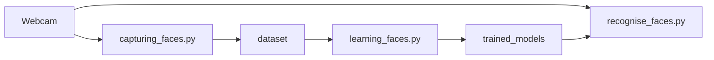

# Face Detection & Recognition (OpenCV + Keras)

A small end-to-end demo that shows a complete workflow:

1. Capture face samples from a webcam
2. Train a lightweight CNN classifier
3. Run real-time recognition

> This repository is intended for learning/demos. It is **not** production-grade biometric identification.

---

## Features

- **Face capture**: saves cropped face images into `dataset/<person>/`
- **Training**: trains a simple CNN classifier with augmentation
- **Recognition**: real-time detection + prediction with confidence threshold
- **Reproducible outputs**
  - `.keras` model file
  - `labels_*.json` label mapping to keep inference correct

---

## Requirements

- Python 3.9+ (3.x should work; 3.9+ recommended)
- A webcam (PC / Raspberry Pi camera via OpenCV)
- Dependencies:
  - OpenCV (`opencv-python`)
  - TensorFlow / Keras

Example install:

```bash
python -m venv .venv
source .venv/bin/activate  # Windows: .venv\\Scripts\\activate
pip install --upgrade pip
pip install opencv-python tensorflow
```

---

## Project structure

```
.
├── Resources/
│   └── haarcascade_frontalface_default.xml
├── capturing_faces.py
├── learning_faces.py
├── recognise_faces.py
├── dataset/                # generated (your captured images)
│   ├── Alice/
│   └── Bob/
└── trained_models/         # generated (model + labels)
    ├── face_model_128x128.keras
    └── labels_128x128.json
```

---

## 1) Capture samples

Capture face crops for a person into `dataset/<person>/`.

```bash
python capturing_faces.py --person "Alice" --num-images 150
python capturing_faces.py --person "Bob"   --num-images 150
```

Useful options:
- `--camera 0` (choose camera index)
- `--warmup 2.0` (seconds before capture starts)
- `--interval-ms 300` (time between saved images)
- `--min-face-size 60` (ignore tiny faces)
- `--margin 0.15` (crop margin around detected face)
- `--no-preview` (headless capture)

> Tip: Capture in multiple lighting conditions and angles. More variety beats “more of the same”.

---

## 2) Train the model

Train using `dataset/<class>/*.jpg` folders.

```bash
python learning_faces.py --dataset-dir dataset --img-size 128 --epochs 15
```

Outputs (example):
- `trained_models/face_model_128x128.keras`
- `trained_models/labels_128x128.json`

Optional:
- `--plot` (plots accuracy/loss curves if matplotlib is installed)
- `--batch-size 32`
- `--val-split 0.25`

---

## 3) Run real-time recognition

```bash
python recognise_faces.py \
  --model trained_models/face_model_128x128.keras \
  --labels trained_models/labels_128x128.json \
  --img-size 128
```

Options:
- `--min-confidence 0.50` (threshold for “unknown” vs known)
- `--draw-all-scores` (overlay top-3 scores next to the face)

Press **ESC** to quit.

---

## Architecture



---

## Notes on accuracy

Accuracy depends heavily on:
- dataset size and diversity (angles, distance, expressions)
- lighting conditions
- camera quality
- how well the face detector crops consistent regions

If you see high accuracy (e.g. **~98%**) it may be because:
- the dataset is small and very “clean”
- validation split contains very similar images to training
- there are only a few classes

For a more realistic evaluation:
- collect data across multiple days/rooms
- increase class count
- create a separate test set

---

## Safety, privacy, and ethics

- Do **not** track or identify people without explicit consent.
- Do **not** use this demo for sensitive or high-stakes identification (security, law enforcement, hiring, etc.).
- Store datasets and model files carefully; they can be personally identifying.

---

## License

Add a `LICENSE` file (MIT/Apache-2.0/etc.) 


#Usage


1) Run capturing_faces.py for diffrent users (using opencv for capturing faces from camera)

2) Run learning_faces.py for learning user faces (using tensorflow-keras for cnn deep learning)

3) Run Recognise_faces.py for  recognising faces that learned (using opencv and tensorflow-keras)


